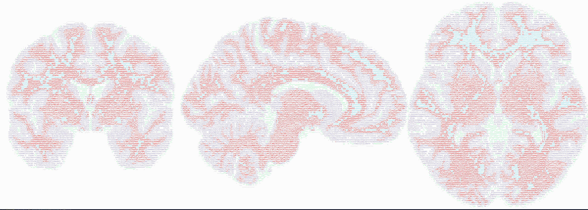

# ascnii

If you always wanted to plot NIfTI images in terminal using ASCII characters,
you can do so now using the command line tool `ascnii`.

However, for now, `ascnii` assumes that the image is in MNI space, and will
likely not work for other kinds of inputs (at the moment).

# Set up:

You can simply install from PyPI:

`pip install ascnii`

You may or may not want to set up a virtual environment.

```sh
python3 -m venv .examplevenv
source .examplevenv/bin/activate
pip install -U pip
```

Alternatively, you can install from github.
Clone the repository to where you would like to install it.

```
git clone https://github.com/LeSasse/ascnii.git
cd ascnii
pip install -e .
```

# How to use:

Run `ascnii --help`:

```
usage: ascnii [-h] [-o OUTPUT] [-H] [-C COLUMNS] [-c] [-m COLORMAP]
              [-b {black,red,red,green,yellow,blue,magenta,cyan,white}]
              [-t THRESHOLD] [-cc CUT_COORDS CUT_COORDS CUT_COORDS] [-a] [-d]
              nifti

View NIfTI images in terminal using ASCII characters.

positional arguments:
  nifti                 Path to the NIfTI file.

optional arguments:
  -h, --help            show this help message and exit
  -o OUTPUT, --output OUTPUT
                        How to output the brain image. By default, prints to
                        {'terminal'}. Otherwise, accepts a path to a html file or a
                        txt file.
  -H, --header          If activated, print out the image header as well.
  -C COLUMNS, --columns COLUMNS
                        Number of character columns (in terminal) to use for
                        plotting.
  -c, --colorbar        If activated, a colorbar is plotted with the brain images.
  -m COLORMAP, --colormap COLORMAP
                        Choose a colormap for the image.
  -b {black,red,red,green,yellow,blue,magenta,cyan,white}, --background {black,red,red,green,yellow,blue,magenta,cyan,white}
                        Choose a terminal color for the background.
  -t THRESHOLD, --threshold THRESHOLD
                        Threshold the given image below this value.
  -cc CUT_COORDS CUT_COORDS CUT_COORDS, --cut_coords CUT_COORDS CUT_COORDS CUT_COORDS
                        MNI coordinates at which to plot the image.
  -a, --annotate        If activated, positions and left/right annotation are
                        added.
  -d, --draw_cross      If activated, a cross is drawn on the plot to indicate the
                        cut position.
```

# Examples:

## Simple default plot of an anatomical image (3D) on a small terminal window:

`ascnii example_img.nii.gz`:


You can also plot 4D NIfTI images, `ascnii` will simply plot the mean image.

## Adjust the resolution with the `--columns` option:

By default, `ascnii` will use the complete width of the terminal, but you may want
to adjust width manually.
Make sure to zoom out a bit, so your terminal has enough space and
run `ascnii example_img.nii.gz --columns 600`:


This is also useful if you want to output the ASCII image as an html to achieve higher
resolution. For example `ascnii example_img.nii.gz --columns 1000 -o example_html.html`
results in the image [here](./examples/example_html.html).

## Change colormap and background color:

In order to change the colormap choose any of the [matplotlib colormaps](https://matplotlib.org/stable/tutorials/colors/colormaps.html)
and hand them over as strings to the `--colormap` option. At the same time you can
also change the background color by handing any of the values listed for the
`--background` option. Run `ascnii example_img.nii.gz -m plasma -b white`:

